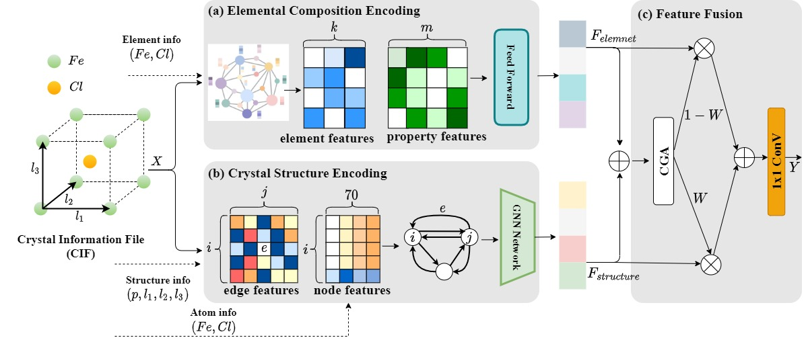
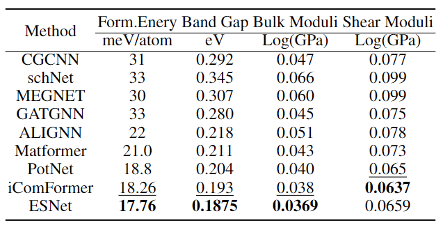
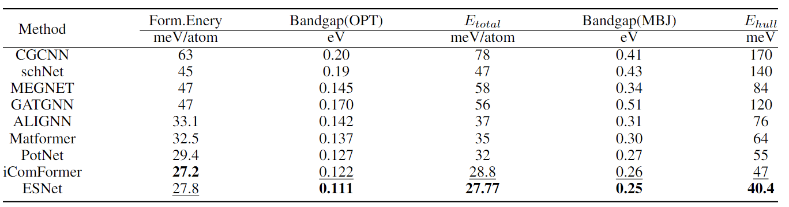

# ESNet: A Dual-Modal Joint Framework of Elemental Composition and Crystal Structure for Material Properties Prediction




## Dataset

### The Materials Project Dataset

For tasks in The Materials Project, we follow Matformer (Yan et al.) and use the same training, validation, and test sets.
For bulk and shear datasets, the datasets are avaliable at https://figshare.com/projects/Bulk_and_shear_datasets/165430

### JARVIS dataset

JARVIS is a newly released database proposed by Choudhary et al.. For JARVIS dataset, we follow ALIGNN and use the same training, validation, and test set. We evaluate our ComFormer on five important crystal property tasks, including formation energy, bandgap(OPT), bandgap(MBJ), total energy, and Ehull. The training, validation, and test set contains 44578, 5572, and 5572 crystals for tasks of formation energy, total energy, and bandgap(OPT). The numbers are 44296, 5537, 5537 for Ehull, and 14537, 1817, 1817 for bandgap(MBJ). The used metric is test MAE. 


## Benchmarked results

### The Materials Project Dataset

### JARVIS dataset



## Enviroment

```bash
conda create --name esnet python=3.10
conda activate esnet
conda install pytorch torchvision torchaudio pytorch-cuda=11.6 -c pytorch -c nvidia # or higher version if you want
conda install pyg -c pyg
pip install torch==2.1.0
pip install torch_geometric
pip install pandarallel
pip install pydantic_settings
pip install torch_scatter
pip install e3nn
pip install torch_sparse
pip install numpy==1.26.4
pip install jarvis-tools==2022.9.16
pip install einops
python setup.py
```

## Training

```bash
cd esnet/scripts
python train_jarvis.py # for jarvis
python train_mp.py # for the materials project
```

## Acknowledgement

This work was supported by the "Kechuang Yongjiang 2035" key technology breakthrough plan of Zhejiang Ningbo((grant nos. 2024Z119).

## Contact

If you have any question, please contact me at chuang@ict.ac.cn.
